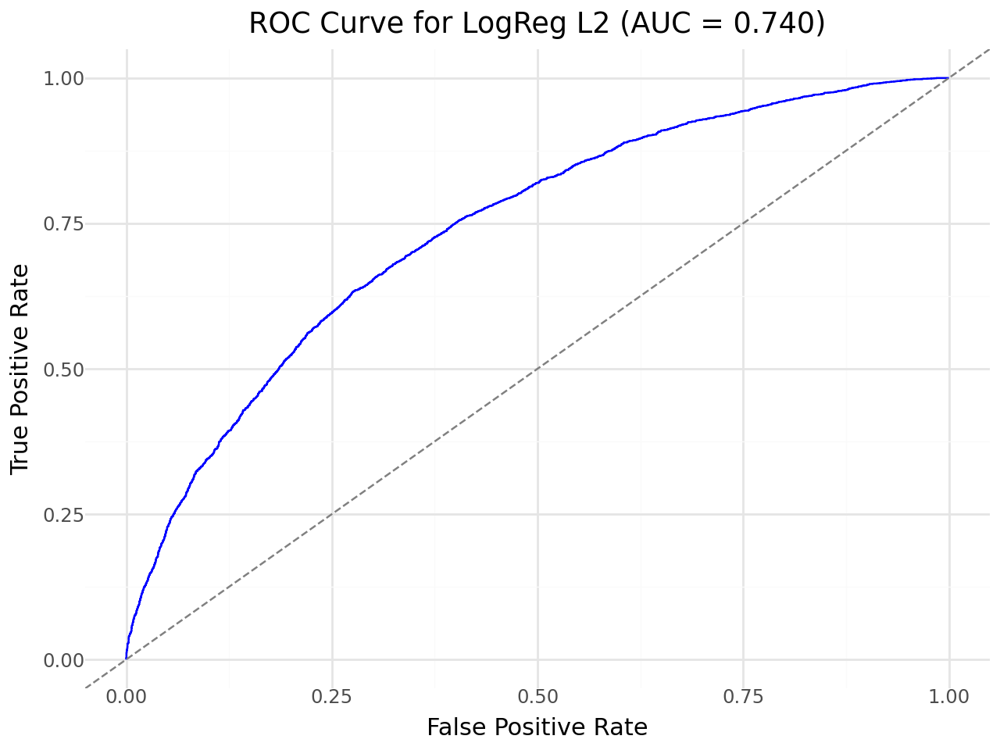
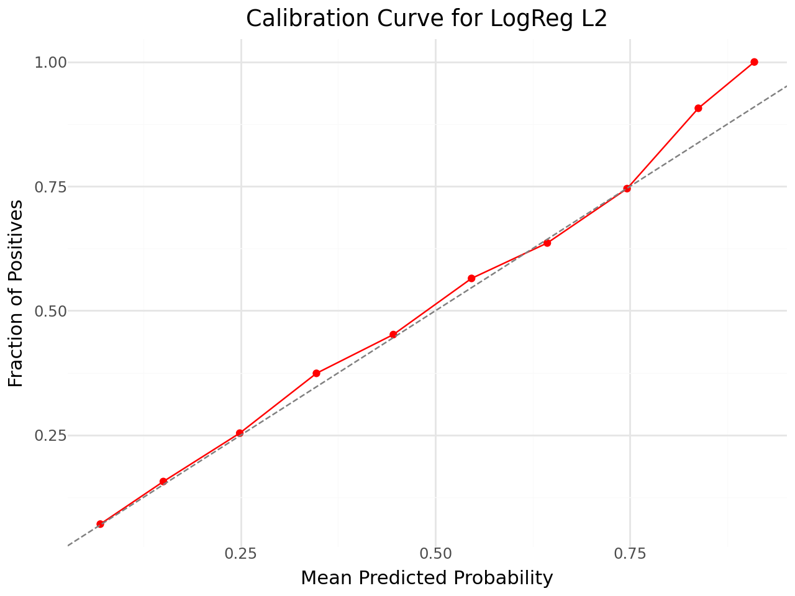
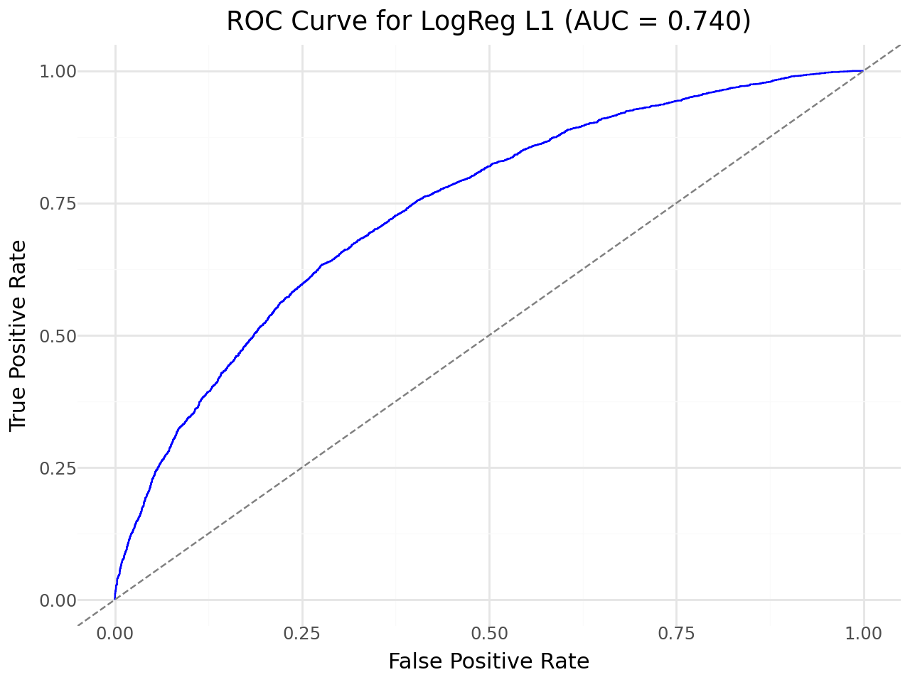
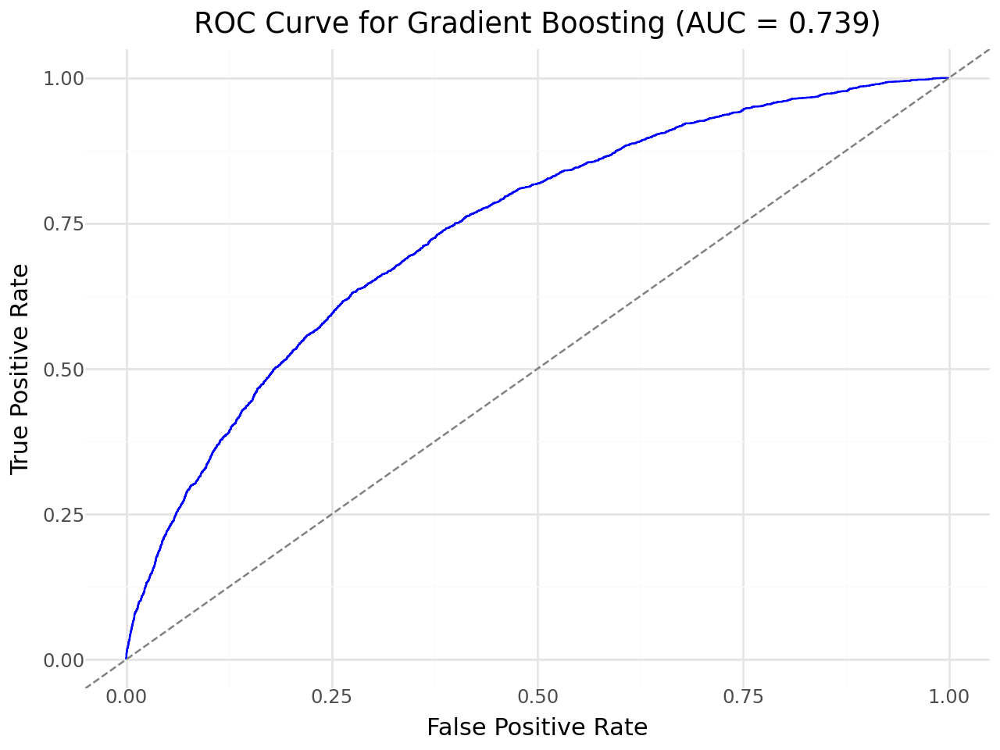
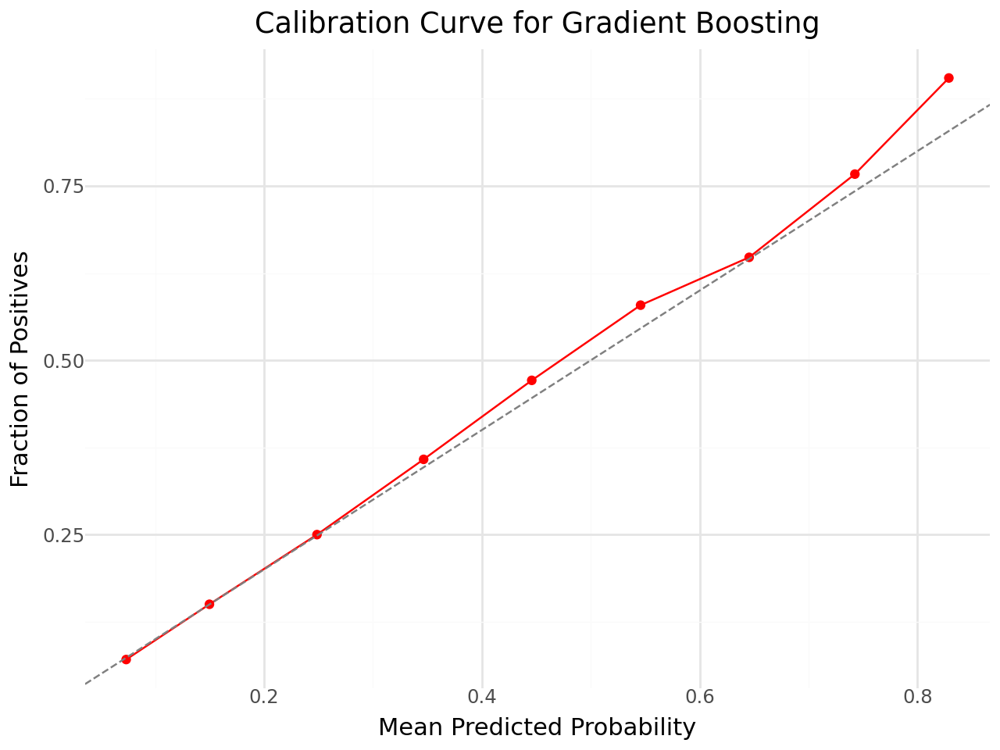

# Customer Churn Prediction Model

## Tech Stack

**Language & Environment**

- Python
- Google Colab

**Libraries Used**

- `pandas`, `numpy` – Data manipulation
- `plotnine` – Data visualization (ggplot-style)
- `scikit-learn` – Modeling and evaluation
  - `LogisticRegression`, `GradientBoostingClassifier`
  - Preprocessing: `StandardScaler`
  - Validation: `train_test_split`
  - Metrics: `accuracy_score`, `recall_score`, `precision_score`, `roc_auc_score`, `roc_curve`

---

## Introduction

The goal of this analysis is to **predict customer churn** for a streaming service based on demographic and behavioral factors. The dataset contains 95,844 records and includes the following features:

- **gender**: Customer’s gender (woman, man, nonbinary, other)  
- **age**: Customer’s age  
- **income**: Customer’s income  
- **monthssubbed**: Number of months subscribed  
- **plan**: Subscription plan (A, B, P)  
- **meanhourswatched**: Average hours watched per month  
- **competitorsub**: Indicator of competitor subscriptions  
- **numprofiles**: Number of user profiles in account  
- **cancelled, downgraded, bundle, kids**: Behavioral flags  
- **longestsession**: Duration of longest session  
- **topgenre, secondgenre**: Favorite genres  
- **churn**: Target variable (0 = retained, 1 = churned)  

The primary objective is to **classify customers who are likely to churn** using both **Logistic Regression** (L1 & L2 regularization) and **Gradient Boosting Classifier**, providing insights for targeted retention strategies.

---

## Methods

### Data Cleaning & Preprocessing

- Examined missing values and dropped rows with missing `age`, `income`, or `cancelled` values  
- One-hot encoded categorical variables (`gender`, `plan`, `topgenre`, `secondgenre`)  
- Standardized numerical features using `StandardScaler` for Logistic Regression  

### Modeling Approach

1. **Train-Test Split:**  
   - 90% training, 10% testing  
2. **Logistic Regression:**  
   - L2 penalty (Ridge)  
   - L1 penalty (Lasso, solver='liblinear')  
   - Predictions and probabilities used for ROC and calibration curves  
3. **Gradient Boosting Classifier:**  
   - 100 estimators, learning rate = 0.1, max_depth = 3  

### Evaluation Metrics

- **Accuracy** – Fraction of correctly classified samples  
- **Recall** – Fraction of actual churners correctly identified  
- **Precision** – Fraction of predicted churners that were correct  
- **ROC AUC** – Model’s ability to distinguish between churners and non-churners  
- Calibration curves – Compare predicted probabilities with actual outcomes  

---

## Results

### Logistic Regression (L2)

| Metric    | Train   | Test   | Interpretation                          |
|-----------|---------|--------|----------------------------------------|
| Accuracy  | 0.7416  | 0.7369 | Correctly classifies ~74% of customers |
| Recall    | 0.2744  | 0.2821 | Captures ~28% of actual churners       |
| Precision | 0.6052  | 0.6203 | Predicted churners are correct ~62% of the time |
| ROC AUC   | 0.7354  | 0.7400 | Decent discrimination ability           |


> The first plot shows the Receiver Operating Characteristic (ROC) curve for the L2 Logistic Model's predictions. The blue curve lies well above the diagonal dashed line, which represents random guessing. This indicates that the model is able to distinguish between the two classes much better than random chance. The steep initial rise of the curve shows that the model can capture a large portion of true positives while keeping false positives low in the early stages. The curve gradually flattens toward the top-right, suggesting that as the model captures nearly all positives, it also starts including more false positives. Overall, the high placement of the curve suggests good predictive performance, with an Area Under the Curve (AUC) of 0.7400, meaning the model is moderately effective at classification.


> The second plot shows the calibration curve for the L2 Logistic Model's predicted probabilities. The red points lie close to the diagonal dashed line, indicating that the model’s predicted probabilities generally match the observed frequencies. There is a slight upward deviation at higher probabilities, suggesting the model somewhat overestimates positive outcomes in this range. Overall, the curve shows decent calibration, meaning the model’s probability estimates are reasonably reliable.

### Logistic Regression (L1)

| Metric    | Train   | Test   | Interpretation                       |
|-----------|---------|--------|-------------------------------------|
| Accuracy  | 0.7415  | 0.7368 | Very similar to L2 performance      |
| Recall    | 0.2744  | 0.2821 | Low, but comparable to L2           |
| Precision | 0.6050  | 0.6199 | Moderate precision                  |
| ROC AUC   | 0.7354  | 0.7400 | Similar discrimination as L2        |


> The third plot displays the ROC curve for the L1 Logistic Model. The blue curve rises above the diagonal random line, demonstrating that the model can distinguish between positive and negative cases better than chance. The initial slope is less steep than the L2 model, indicating a slightly lower ability to capture true positives early with few false positives. Overall, the curve suggests moderate predictive performance, with an AUC reflecting reasonable classification accuracy.


> The fourth plot presents the calibration curve for the L1 Logistic Model. The red points follow the diagonal line closely, showing that predicted probabilities are largely in line with actual outcomes. Minor overestimation occurs at very high probabilities, but overall the model provides fairly accurate probability estimates across most ranges.

**Observation:** Both L1 and L2 logistic regression models perform similarly. Train and test scores are close, indicating no strong overfitting.

### Gradient Boosting Classifier

| Metric    | Train   | Test   | Interpretation                                    |
|-----------|---------|--------|--------------------------------------------------|
| Accuracy  | 0.7440  | 0.7360 | Slight improvement in training accuracy         |
| Recall    | 0.2655  | 0.2687 | Low, similar to logistic regression             |
| Precision | 0.6217  | 0.6238 | Moderate precision, slightly higher than logistic regression |
| ROC AUC   | 0.7400  | 0.7389 | Comparable discrimination ability               |


> The fifth plot shows the ROC curve for the Gradient Boosting model. The blue curve rises sharply above the diagonal, indicating strong discriminative ability. True positives are captured quickly with few false positives at the beginning, and the curve gradually flattens toward the top-right as additional positives are identified. The high AUC suggests strong overall predictive performance.


> The sixth plot shows the calibration curve for the Gradient Boosting model. The red points roughly follow the diagonal line, though there is some overestimation at higher predicted probabilities. This suggests the model is fairly well-calibrated overall, with a slight tendency to be overconfident when predicting near-certain positive outcomes.

**Observation:** Gradient boosting provides similar performance to logistic regression but slightly improves precision on churn prediction.

---
## Recommendation System

Since both the logistic regression (L2) and gradient boosting models perform similarly, logistic regression with L2 regularization was selected for integration into the recommendation system due to its interpretability and faster training.

**Implementation Steps:**
1. Predict churn risk in a dataset containing new customers using the trained logistic regression model.

> New customers data: https://github.com/chelseaparlett/CPSC392ParlettPelleriti/blob/master/Data/streamingNEW.csv

`new_customers = pd.read_csv("https://raw.githubusercontent.com/cmparlettpelleriti/CP_new_customers.csv")`

2. Preprocess new customer data (drop missing age/income, one-hot encode categorical features, scale numerical values).

```
# Drop missing values
new_customers.dropna(subset=['age', 'income'], inplace=True)
new_customers.reset_index(drop=True, inplace=True)

# One-hot encode
obj_cols = new_customers.select_dtypes(include=[object]).columns.tolist()
new_customers = pd.get_dummies(new_customers, columns=obj_cols)

# Scale features
new_customers_scaled = scaler.transform(new_customers)
```
3. Generate churn probabilities and identify the top 200 most at-risk customers.

```
new_customer_probabilities = log_reg_l2.predict_proba(new_customers_scaled)
churn_probs = new_customer_probabilities[:, 1]  # Probability of churn

top_indices = np.argsort(churn_probs)[::-1][:200]
top_customers = new_customers.iloc[top_indices].copy()
top_probs = churn_probs[top_indices]
```

4. Find similar existing customers by:
 a. Training a Nearest Neighbors model on the “favorites” dataset using age, income, and mean hours watched.

> favorites dataset: https://github.com/chelseaparlett/CPSC392ParlettPelleriti/blob/master/Data/streamingFILMS.csv

```
favorites = pd.read_csv("https://raw.githubusercontent.com/cmparlettpelleriti/CPSC39_favorites.csv")

favorites_filtered = favorites[['age', 'income', 'meanhourswatched']]
favorites_scaled = scaler.fit_transform(favorites_filtered)

nn = NearestNeighbors(n_neighbors=10, algorithm='auto')
nn.fit(favorites_scaled)
```

 b. Matching each high-risk customer to their top 10 most similar users based on Euclidean distance in standardized space.

```
top_risk_scaled = scaler.transform(top_customers[['age', 'income', 'meanhourswatched']])
distances, indices = nn.kneighbors(top_risk_scaled)
top_customers['top_10_similar_users'] = indices.tolist()
```

 c. Output a dataset (top_200_with_neighbors.csv) containing customer profiles, churn risk scores, and top 10 similar users for personalized retention offers via Streamlit.

```
top_customers.to_csv("top_200_with_neighbors.csv", index=False)

!pip install streamlit pyngrok --quiet

import streamlit as st
import pandas as pd
import ast
from pyngrok import ngrok

ngrok.set_auth_token("[YOUR_TOKEN_HERE]")

%%writefile app.py
import streamlit as st
import pandas as pd
import ast

top_200_df = pd.read_csv("top_200_with_neighbors.csv")
favorites = pd.read_csv("https://raw.githubusercontent.com/cmparlettpelleriti/CPSC392ParlettPelleriti/master/Data/streamingFILMS.csv")

st.title("High-Risk Customer Recommendations")
st.write("Top 200 customers predicted to churn, with suggested retention strategies and content recommendations.")

top_200_df['top_10_similar_users'] = top_200_df['top_10_similar_users'].apply(ast.literal_eval)
movie_columns = [f'Film{i}' for i in range(1, 11)]

def get_recommendations(neighbor_indices):
    recs = []
    for idx in neighbor_indices:
        if idx < len(favorites):
            movies = favorites.loc[idx, movie_columns].tolist()
            recs.append(movies)
    return recs

top_200_df['recommended_movies'] = top_200_df['top_10_similar_users'].apply(get_recommendations)

st.dataframe(top_200_df[['age', 'income', 'monthssubbed', 
                         'meanhourswatched', 'top_10_similar_users', 
                         'recommended_movies']])

from pyngrok import ngrok

ngrok.set_auth_token("31AN9gGWT29IHFrodIeBEFvydcj_6mMwuscXssRBBDqcLpcKc")
!streamlit run app.py &>/dev/null&

public_url = ngrok.connect(8501)
print("Streamlit app live at:", public_url)
```

This approach allows the business to proactively reach out to high-risk customers with targeted recommendations inspired by the preferences of similar users, increasing the likelihood of retention.

Streamlit Demo:
https://22f10f4996b5.ngrok-free.app/

---

## Discussion / Reflection

- **Logistic regression and gradient boosting** both provide moderate predictive power  
- **Low recall** indicates that many churners are missed; more feature engineering or alternative modeling may improve this  
- **Precision** is moderate, suggesting predicted churners are somewhat reliable  

**Future work:**

- Incorporate behavioral patterns over time (watch history trends)  
- Test additional ensemble models or hyperparameter tuning  
- Explore feature importance to identify key churn drivers  

Overall, this analysis provides a foundation for **targeted retention strategies**, helping the service identify at-risk customers and optimize engagement.
